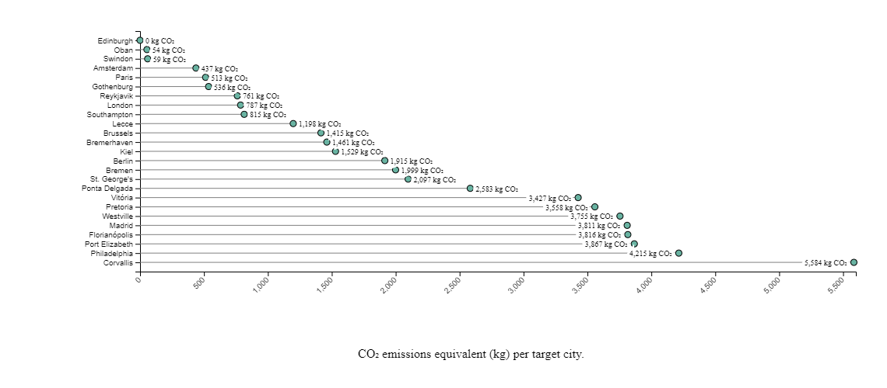
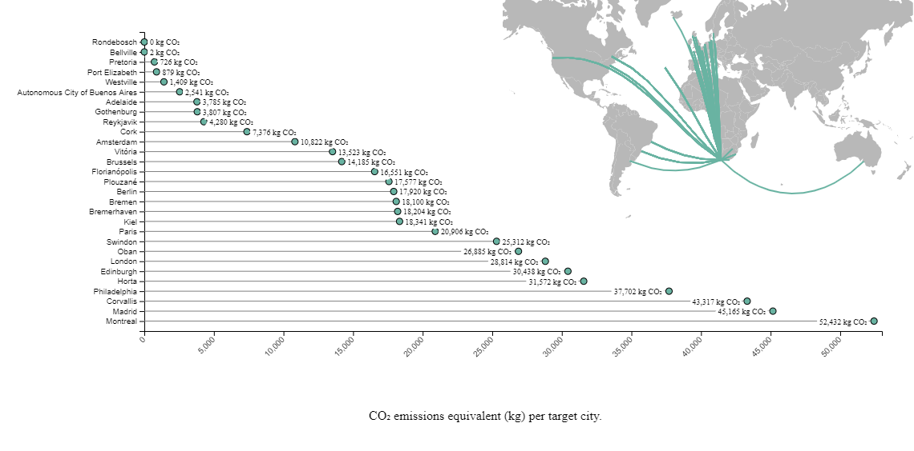

# iAtlantic CO2 footprint

This is an approach to track the CO2 emissions caused by travelling to iAtlantic meetings. 
The [iAtlantic project](https://www.iatlantic.eu/) had two general meetings so far, the iAtlantic Kick Off Meeting in Edinburgh in 2019 and the virtual iAtlantic General Assembly 2020.
For both meetings we estimated the travel carbon footprint using the [Travel Carbon Footprint Estimator](https://travel-footprint-calculator.irap.omp.eu/home.html) by Didier Barret.
Of course, the travel carbon footprint of the virtual iAtlantic General Assembly 2020 is a theoretical value, if the physical meeting in Cape Town would not have been cancelled
due to Covid-19 and if all participants would have actually attent the physical meeting.

## Data preparation
The estimation is based on data that was collected for both meetings listing the number of participants per country (see [KO2019](data/iAtlantic_KickOff2019_particitpants_orig.csv) and [GA2020](data/iAtlantic_GA2020_particitpants_orig.csv)). 
The [Travel Carbon Footprint Estimator](https://travel-footprint-calculator.irap.omp.eu/home.html) needs additional information about the cities the participants come from.
This information was approximated by:
1. List all cities of a country mentioned in the iAtlantic Grant Agreement.
2. Distribute the amount of participants evenly across the cities.
3. Format the data into the appropriate format (see [KO2019 cities](iAtlantic_KickOff2019_particitpants_cities_added.csv) and [GA2020 cities](data/iAtlantic_GA2020_particitpants_cities_added.csv))

Note that this method does not necessarily agree with reality and adds a potential error source.

## Preliminary results
The iAtlantic Kick Off Meeting in Edinburgh in 2019 had 55 participants from 15 countries located in Europe, America and Africa. 
The estimated travel CO2 emission equivalents of this meeting is 50.2 tons (click [here](https://travel-footprint-calculator.irap.omp.eu/estimation/2020-07-30_14:37:52_d3c6.html) for more details).
On the iAtlantic General Assembly in 2020, that needed to be hold virtually because of Covid-19, 144 members attended from 16 countries located in Europe, America, South Africa and Australia (click [here](https://travel-footprint-calculator.irap.omp.eu/estimation/2020-07-30_14:35:13_d0fb.html) for more details).
This are 2.6 times the amount of the participants which attended the physical meeting in 2019. 
If all 144 participants would have attended the planned physical meeting in South Africa, they would have emmitted 512.6 tons of CO2 emission equivalents by travelling to the meeting location.
This is 10 times as high as the emission estimated for the 2019 Kick Off meeting in Edinburgh.

### iAtlantic Kick Off Meeting 2019

Estimated by the [Travel Carbon Footprint Estimator](https://travel-footprint-calculator.irap.omp.eu/home.html) by Didier Barret using ADEME (mul. factor=2, from Carbon database), MYCLIMATE (mul. factor=2), DEFRA (mul. factor=RFI=1.9) and train travel assumed for distances below 500 km .

### iAtlantic General Assembly 2020 - v2 (success)

Estimated by the [Travel Carbon Footprint Estimator](https://travel-footprint-calculator.irap.omp.eu/home.html) by Didier Barret using ADEME (mul. factor=2, from Carbon database), MYCLIMATE (mul. factor=2), DEFRA (mul. factor=RFI=1.9) and train travel assumed for distances below 500 km .
